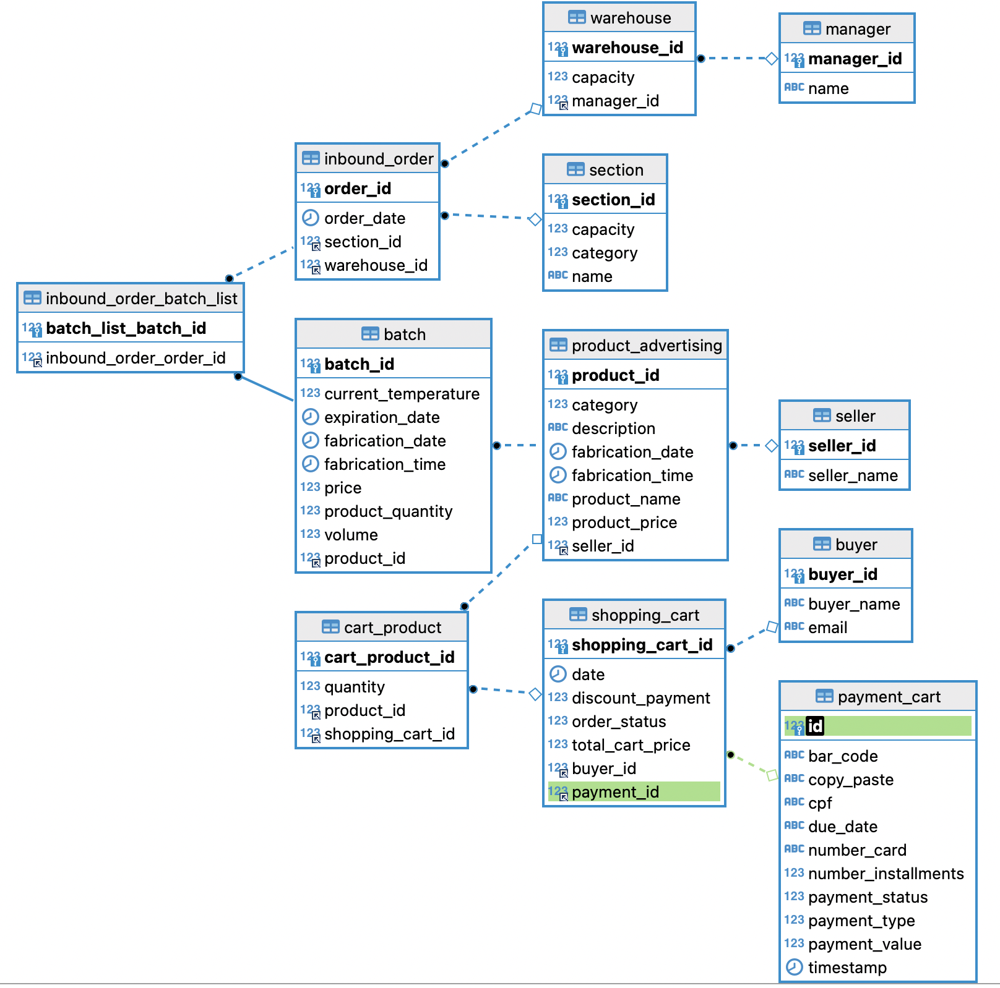

  

## API Requisito 6 - Pagamentos
Desenvolvimento de uma API REST para pagamento de pedidos.

A API foi desenvolvida para:

- Realizar pagamento através do cartão de crédito

- Realizar pagamento através de boleto bancário

- Realizar pagamento através de Pix QR Code

- Consultar o pagamento feito através de cartão de crédito

- Consultar o pagamento feito através de boleto bancário

- Consultar o pagamento feito através de Pix QR Code

### Habilidades

Implementa uma API REST para efetuar pagamentos de carrinhos de compra

- Estruturar a API conforme as boas práticas seguindo a arquitetura MSC e alguns princípios do SOLID:
    - Entities: Reponsável por modelar as entidades.
    - Repository: É a camada de comunicação com o banco de dados.
    - Service: Camada onde gerenciamos as regras de négocio.
    - Controller: Responsável por receber as requisições e enviar as respostas.
    - Advisor: Responsável por gerenciar as exceções da aplicação.
    - DTO: Responsável pelo transporte de dados entre diferentes componentes de um sistema.

Tecnologias
- O desafio foi realizado utilizando Java 11 com Spring Boot, suas anotações de validação somando as dependências:
    - Spring Boot DevTools.
    - Spring Boot Web.
    - Spring Boot Validation.
    - Lombok.
    - JUnit.
    - Mockito.
    - Java Mail Sender
    - Swagger

### O que foi desenvolvido
As rotas implementadas para contemplar estas questões foram:

- Pagamento com cartão de crédito:
  - `/api/v1/payment-shopping-cart/credit-card`: responsável por efetuar pagamento com cartão de crédito. 

- Pagamento com boleto bancário:
  - `/api/v1/payment-shopping-cart/bank-slip`: responsável por efetuar pagamento com boleto bancário

- Pagamento com Pix QR Code:
  - `/api/v1/payment-shopping-cart/pix`: responsável por verificar a localização de um produto em todos os armazéns para saber o estoque em cada armazém do referido produto.

- Consultar Pagamento via cartão de crédito:
  - `/api/v1/payment-shopping-cart/credit-card`: responsável por consultar pagamentos realizados com cartão de crédito.

-  Consultar Pagamento via boleto bancário:
   - `/api/v1/payment-shopping-cart/bank-slip`: responsável por consultar pagamentos realizados com boleto bancário.

- Consultar Pagamento via Pix QR Code:
  - `/api/v1/payment-shopping-cart/pix`: responssável por consultar pagamentos realizados com Pix QR Code.
  
_As rotas utilizadas foram idealizadas para deixar a aplicação mais dinâmica e funcional para o público alvo._

### Validações

Entre as anotações de __validação__ do Spring Boot, que foram utilizadas na camada `Entities` de cada entidade, estão:

- __NotBlank__, para validar que um campo de String não pode estar vazio;

- __NotNull__, para validar um campo numérico que não pode estar nulo;

- __Size__, para determinar o tamanho mínimo ou máximo de um Objeto ou String;

- __DecimalMin__, para determinar o tamanho mínimo de um número cujo valor seja maior ou igual ao especificado;

- __Email__, para determinar se o formato do e-mail é válido;

### Testes

Os testes de unidades e de integração foram feitos utilizando o JUnit para as assertions e Mockito para fazer os Mocks.

As camadas foram testadas, com cobertura de miníma de 80% de métodos e linhas, verificando a consistência dos métodos utilizados para o desenvolvimento do projeto.

### Documentação da API
A ferramenta escolhida para documentar a API foi o Postman e Swagger

:warning: Acesse a documentação do Postman [aqui](https://documenter.getpostman.com/view/23629202/2s8YmULKrm).

## Diagrama de Entidade-Relacionamento (DER)

## Como acessar o projeto
Acessar o repositório do desafio [aqui](https://github.com/wave7-grupo3/desafio_integrador/tree/ml-payment-shopping-cart-06)

Abrir o terminal e digitar as informações na sequência:
- Realizar o clone do projeto:
    - SSH: `git clone git@github.com:wave7-grupo3/desafio_integrador.git`
    - HTTPS: `git clone https://github.com/wave7-grupo3/desafio_integrador.git`

- Ter o ambiente configurado para vizualização de projetos java.
- Gerar a documentação do JavaDocs:
    - Na barra superior da IDE IntelliJ, selecionar a aba `Tools`;
    - Em seguida, selecionar `generate JavaDoc`;

